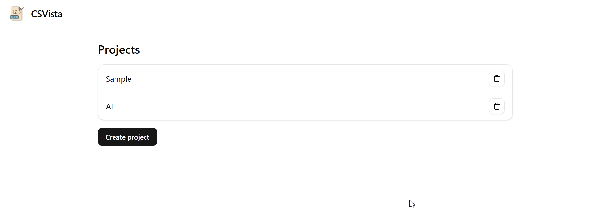
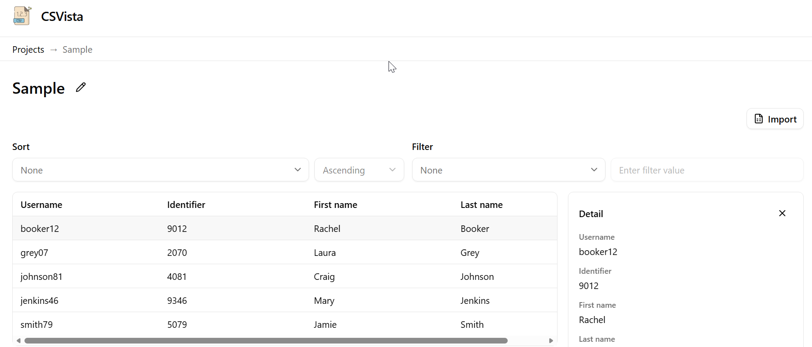
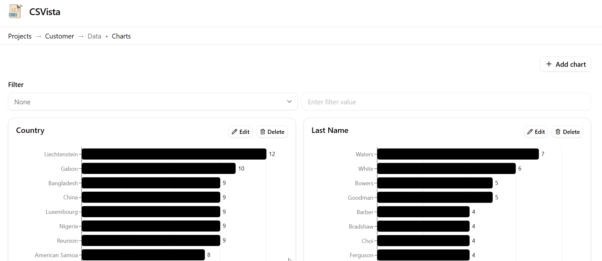

# CSVista

CSVista is a CSV Viewer web application.

Homepage: [https://hintdesk.github.io/csvista](https://hintdesk.github.io/csvista)

Users can create a project, upload one CSV file, and explore the data in both table and chart views directly in the browser.

## Screenshots

## Main Features

- CSV import and online viewing
  - Import CSV into the selected project
  - Render tabular data with pagination
  - Show row detail panel
- Data operations
  - Sort by any column (ascending or descending)
  - Filter by selected column and text query
  - Filter supports a None option (no filtering)
- Charts
  - Add multiple charts per project
  - Build horizontal bar charts by selected field
  - Edit and delete charts
  - Apply current filter to chart data
- Local persistence
  - Projects are stored in localStorage
  - Project data is stored in IndexedDB
  - Deleting a project also removes its IndexedDB table

## Tech Stack

- React 19
- TypeScript
- Vite
- Tailwind CSS
- idb (IndexedDB wrapper)
- Papa Parse (CSV parsing)

## Getting Started

1. Install dependencies

   npm install

2. Start development server

   npm run dev

3. Build for production

   npm run build

4. Preview production build

   npm run preview

## Notes

- All data stays in the browser (no backend service).
- This app is designed for fast local CSV inspection and exploration.
